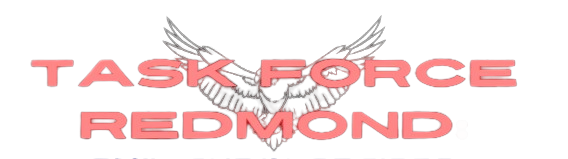

# Edging to freedom one day at a time...
**A Nightmare Studios Production**

- [BRIDGES](https://bridges-cs.herokuapp.com/assignments/5/gugu)
- [FINAL REPORT](https://docs.google.com/document/d/14hk3kF-KI3cDMsnP8Oeztgp7Ecbf-U4KPghMPuHUC2M/edit?usp=sharing)

**The nightmare team of CSCI41 made up of:**
  - Scrum Lord/Project Manager: Rahmi Abi-Rached
  - JJK Curse Lord: Julian Laxamana
  - Spiderman/Thread Lord: Jack Jackson
  - DJ Bridges: Zaniel Silverio
  - Inheritor of Suffering: Aaron Snell
  - Socketroth: Kiyoshi Yang
  - Taste Tester/GTester: Benson Karki
  - ISAD: Nathan Yang
  - Story/art: Matthew Mazone

# Background

# Controls

# Member Report:
**Rahmi Abi-Rached, Project Manager**
- Rahmi's job was to oversee the production of the game, as well as write this readme, make an update log, and produce a final report. He (I) did his best to help as he could, though he often times found himself confused with some of the stuff going on. However, he did make an awesome Mencarelli deepfake.

**Julian Laxamana, JJK Curse Lord**
- Julian was a huge part of making this game happen. He was in charge of using ImGui to make the UI for the game, but he did far beyond that. He did a lot of the complicated stuff that others didn't do or didn't know how to do. He was the most active in communicating with the group and was one of a few people who contributed the most. 

**Jack Jackson, Thread Lord**
- Jack was in charge of handling putting different vital processes into different threads for increased game performance. He created thread classes, and functions to help manage threading better in our code. Without his work, the game may have run slower, possibly even at an unplayable level.

**Zaniel Silverio, DJ Bridges**
- Zaniel was in charge of composing this century's biggest hit album: the music of Task Force Redmond. He composed some original pieces, inspired by the amazing sound track of *HELLDIVERS 2*. He then worked to visualize the soundtrack on BRIDGES, which did propose some issues. However, he worked his way through them.

**Aaron Snell, Inheritor of Suffering**
- Aaron was another huge part of our team. His job was to use inheritance to create things like weapons, enemies, and characters. He completed these tasks at a high standard, and then helped further with other complicated assets of the game. Without his help, the game wouldn't have been nearly as well made as it is.

**Kiyoshi Yang, Socketroth**
- Kiyoshi was made responsible for giving the game networking features. His efforts were well payed off: Task Force Redmond comes complete with multiplayer and a global chat system. Networking is a huge part of what makes games fun, and Kiyoshi was able to provide that for our players.

**Benson Karki, Taste Tester**
- Benson's role was to test all the code as it came out, and hunt down any pesky bugs that it may have. He had to do a lot of his work in the later stages of the game's production, which is when a lot of our code became complete enough to test. He did a great job of helping remove as many bugs as he could find.

**Nathan Yang, ISAD**
- Nathan's role was to integrate the different pieces that other members put together, making it a playable game. This job ended up being split amongst other members. However, Nathan made a big contribution by helping create a console for the game.

**Matthew Mazone, Story/Art**
- Matthew made his biggest contributions outside of the field of coding. He developed all of the game's lore, some dialogue, the maps, weapon and character ideas, boss fights, puzzles, etc. He did a great job, as the game has an amazing storyline full of ups and downs, interesting characters and dialogue, and cool weapons.

> Overall, everyone did a great job of doing what they were responsible for, and no one held the group back from success. The group's hardwork put together a great game that we hope everyone enjoys.
